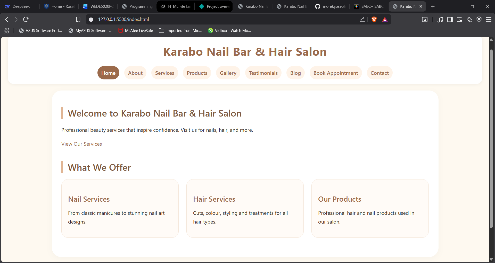
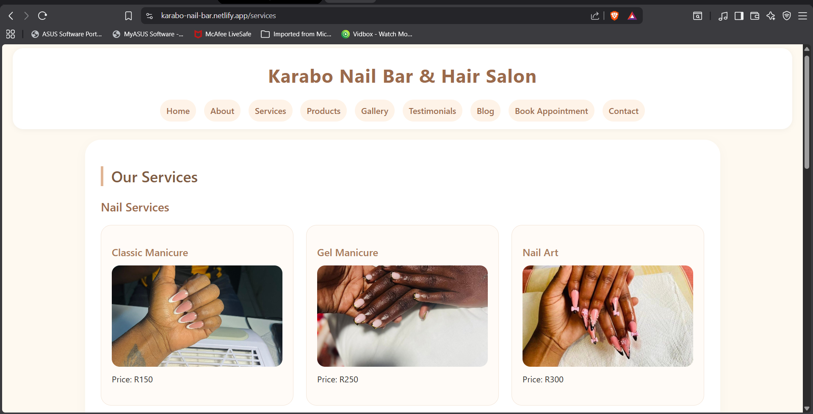
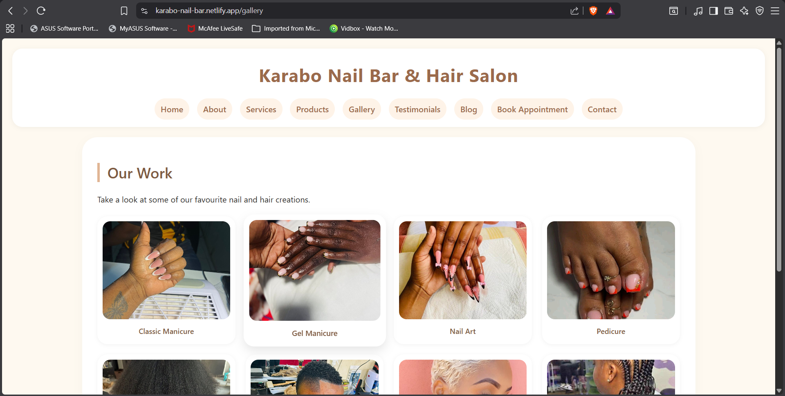

# Karabo Nail Bar & Hair Salon Website

A modern, responsive beauty salon website built with HTML, CSS, and JavaScript.

---

## Pages

| Page                  | File Name                | Description |
|-----------------------|--------------------------|-----------|
| Home                  | `index.html`             | Landing page with welcome message and service overview |
| About Us              | `about-us.html`          | Background, mission, and team information |
| Services              | `services.html`          | Full list of nail and hair services with prices |
| Products              | `products.html`          | Hair and nail products available in-salon |
| Gallery               | `gallery.html`           | Photo gallery of salon work |
| Testimonials          | `testimonials.html`      | Client reviews and feedback |
| Blog                  | `blog.html`              | Beauty tips and salon news |
| Book Appointment      | `book-appointment.html`  | Interactive booking form |
| Contact               | `contact.html`           | Address, phone, hours, and Google Map |

---

##Technologies Used

- **HTML5** — Semantic markup
- **CSS3** — External stylesheet with Grid, Flexbox, and Responsive design
- **JavaScript** — `script.js` for interactivity

---

##Key Features

### JavaScript Interactivity
- **Mobile Hamburger Menu** – Smooth responsive navigation
- **Gallery Lightbox** – Click any image to view in full-screen modal with next/previous buttons
- **Form Validation** – Real-time validation on booking form with success message
- **Active Navigation Highlight** – Current page is highlighted
- **Smooth Scrolling**

### CSS Features
- Fully responsive design (Desktop, Tablet, Mobile)
- CSS Grid & Flexbox layouts
- Beautiful hover effects and transitions
- Responsive images using `<picture>` and `srcset`

### SEO Optimizations
- Unique, keyword-rich title tags on every page
- Descriptive meta descriptions
- Proper heading structure (`h1`, `h2`, `h3`)
- Descriptive `alt` text on all images

---

##Responsive Design

| Breakpoint       | Screen Size     | Changes |
|------------------|-----------------|-------|
| Desktop          | > 1024px        | Full grid layouts |
| Tablet           | ≤ 1024px        | 2-column grids |
| Mobile Large     | ≤ 768px         | Single column + Hamburger menu |
| Mobile Small     | ≤ 480px         | Optimized fonts & full-width buttons |

---

##Deployment
**Live Demo:https://karabo-nail-bar.netlify.app/

---

##Screenshots

---

##Contact Information

- **Address:** 123 Beauty Lane, Midrand, Gauteng, South Africa
- **Phone:** 012 345 6789
- **Email:** info@karabonailbar.co.za
- **Business Hours:** Mon–Fri 09:00–18:00 | Sat 08:00–17:00 | Sunday & Public Holidays: Closed

---

© 2026 Karabo Nail Bar & Hair Salon. All rights reserved.